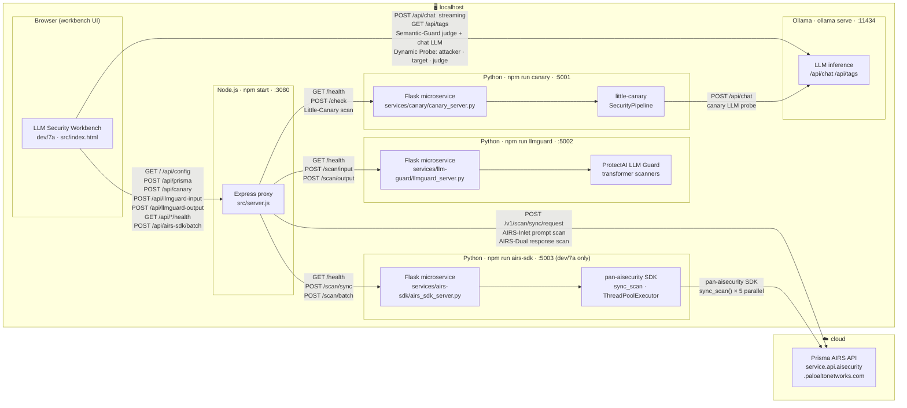

<!--
  WHAT THIS FILE HOLDS:
  Full system architecture for the LLM Security Workbench — component diagram,
  traffic routing table, six-gate security flow diagram, and Node proxy design notes.

  WHY IT EXISTS SEPARATELY:
  These diagrams and routing details are too detailed for README.md but are the
  authoritative reference for anyone building on top of, extending, or debugging
  the workbench infrastructure. README.md links here for readers who need depth.

  CROSS-REFERENCES:
  - docs/SECURITY-GATES.md  — per-gate logic and configuration details
  - docs/5-SETUP-GUIDE.md   — how to start each component
  - src/server.js           — the Node proxy implementation
-->

# Architecture

## Six-Gate Security Flow

When all six gates are active, every prompt passes through local transformer scanning, local LLM judgement, structural injection detection, and cloud scanning — before the LLM is called or the response is shown.


---

## Component Diagram



---

## Traffic Routing

| Traffic | Route |
| :--- | :--- |
| AIRS-Inlet / AIRS-Dual scans (chat) | Browser → Node Proxy `:3080/api/prisma` → Prisma AIRS API (cloud) |
| AIRS SDK batch pre-scan (7a batch runner) | Browser → Node Proxy `:3080/api/airs-sdk/batch` → Flask sidecar `:5003/scan/batch` → Prisma AIRS API (cloud, 5 parallel) |
| AIRS SDK single scan | Browser → Node Proxy `:3080/api/airs-sdk/sync` → Flask sidecar `:5003/scan/sync` → Prisma AIRS API (cloud) |
| LLM-Guard input scan | Browser → Node Proxy `:3080/api/llmguard-input` → Flask sidecar `:5002/scan/input` |
| LLM-Guard output scan | Browser → Node Proxy `:3080/api/llmguard-output` → Flask sidecar `:5002/scan/output` |
| Little-Canary scan | Browser → Node Proxy `:3080/api/canary` → Flask sidecar `:5001/check` → Ollama |
| Sidecar health checks (status dots) | Browser → Node Proxy `:3080/api/llmguard/health`, `/api/canary/health`, `/api/airs-sdk/health` → respective sidecars |
| Ollama health check (Semantic-Guard dot) | Browser → Local Ollama `:11434/api/tags` (direct) |
| LLM inference (chat) | Browser → Local Ollama API `:11434` (direct, streaming) |
| Dynamic Probe — attacker LLM | Browser → Local Ollama API `:11434` (direct, non-streaming) |
| Dynamic Probe — target LLM | Browser → Local Ollama API `:11434` (direct, non-streaming) |
| Dynamic Probe — judge LLM | Browser → Local Ollama API `:11434` (direct, non-streaming) |
| Dynamic Probe — gate checks | Browser → Node Proxy `:3080/api/llmguard-input`, `/api/canary`, `/api/prisma` (same as chat) |
| Credential config | Browser → `GET /api/config` → `{ hasApiKey, profile }` (key never returned) |

---

## Node Proxy Design Notes

The Node.js proxy (`src/server.js`) exists for two reasons:

1. **CORS bypass** — Browsers block direct `fetch()` calls to Prisma AIRS and to the local Flask sidecars because they don't emit `Access-Control-Allow-Origin` headers. The Node proxy makes those requests server-side where CORS doesn't apply.

2. **Credential isolation** — `AIRS_API_KEY` is loaded from `.env` at startup and attached to outbound requests by the proxy. The browser never receives the key — only a boolean `hasApiKey` flag from `/api/config`.

**Key design point:** The browser talks **directly** to Ollama for all LLM inference (Semantic-Guard judge calls, chat streaming, and all three Dynamic Probe roles) but routes through the Node proxy for AIRS, LLM Guard, Little-Canary, and the AIRS SDK sidecar. Direct Ollama access avoids double-buffering the streaming response; the proxy exists only to bypass CORS for cloud API calls and to keep the AIRS API key off the client.

**Dynamic Probe — all three model roles call Ollama directly.** The attacker LLM, the target LLM, and the judge LLM all call `http://localhost:11434/api/chat` from the browser with `stream: false`. None of these calls pass through the Node proxy. The only probe traffic that uses the proxy is the security gate checks (`/api/llmguard-input`, `/api/canary`, `/api/prisma`) — identical to the chat pipeline. This means:
- Attacker and judge traffic is not logged server-side
- The AIRS API key is irrelevant for attacker and judge (they never touch the proxy)
- All three models must be pulled and available in the local Ollama instance
- `OLLAMA_ORIGINS=*` is required for the browser to reach Ollama cross-origin

Ollama requires `OLLAMA_ORIGINS=*` to accept requests from the browser. See the Quick Start in README.md.

---

## UI Layout (dev/7a-airs-sdk)

The workbench uses a full-viewport horizontal flex shell (`#app-shell`) with five named regions:

```
┌──────────┬───────────────────┬──────────────────────┬──────────────────────┐
│ Icon     │ Left Nav Panel    │                      │ Right Telemetry      │
│ Rail     │ (#nav-panel)      │   Main Content       │ Panel                │
│          │                   │   (#main-content)    │ (#right-panel)       │
│ 56px     │ 225px (collapsed: │                      │ 220px (collapsed: 0) │
│ fixed    │ 0, rail stays)    │   flex: 1            │                      │
└──────────┴───────────────────┴──────────────────────┴──────────────────────┘
```

### Panel reference

| Panel | HTML ID / class | Default width | Collapsed width | Toggled by |
| :--- | :--- | :--- | :--- | :--- |
| Icon rail | `#icon-rail` | `56px` (fixed, never collapses) | — | — |
| Left nav panel | `#nav-panel` | `225px` | `0` (class `nav-collapsed`) | 🛡️ brand button or `toggleNavPanel()` |
| Main content | `#main-content` | `flex: 1` (fills remaining space) | — | — |
| Right telemetry panel | `#right-panel` | `220px` | `0` (class `collapsed`) | 📊 rail icon or `toggleRightPanel()` |

### Main content sub-regions (top → bottom, vertical flex)

| Region | HTML ID / class | Behaviour |
| :--- | :--- | :--- |
| Top bar | `.top-bar` | Fixed height (~40px); shows title, model badge, persona badge |
| Chat scroll area | `#chat-scroll-area` | `flex: 1` — only this region scrolls |
| API Inspector drawer | `#debug-drawer` | Slides up above prompt bar; `max-height` transition |
| Prompt bar | `.input-container` | `flex-shrink: 0` — always anchored at bottom |

### Left nav panel panes

The left nav panel hosts two switchable panes, selected via the icon rail:

| Pane | HTML ID | Rail icon | Contents |
| :--- | :--- | :--- | :--- |
| Security Pipeline | `#pane-security` | 🔬 | Gate controls (mode badges, settings) for all 6 gates + sidecar status dots |
| Workspace | `#pane-workspace` | ⬡ | Model selector, persona selector |

### Sidecar status dots (dev/7a)

Each gate that depends on a sidecar shows a small coloured dot (`●`) in its header row in the Security Pipeline pane. Dots are checked at page load via `checkSidecarHealth()` and update dynamically during the batch pre-scan. Hover for the exact status message.

| Gate | Dot ID | Health endpoint | What the dot checks |
| :--- | :--- | :--- | :--- |
| 🔬 LLM-Guard | `sc-llmguard` | `GET /api/llmguard/health` → `:5002/health` | LLM Guard Flask sidecar |
| 🧩 Semantic-Guard | `sc-semantic` | `GET :11434/api/tags` (direct) | Ollama runtime + pulled models |
| 🐦 Little-Canary | `sc-canary` | `GET /api/canary/health` → `:5001/health` | Little-Canary Flask sidecar |
| 🔀 AIRS (In/Out) | `sc-airs` | `GET /api/airs-sdk/health` → `:5003/health` | AIRS Python SDK sidecar + SDK install |

### CSS custom properties for layout dimensions

Defined in `:root` — change these to resize panels globally:

```css
--rail-width:                56px;
--nav-panel-width:          225px;
--debug-drawer-max-height:  360px;
```

The right panel width (`220px`) is set directly on `#right-panel` and not yet a custom property.
