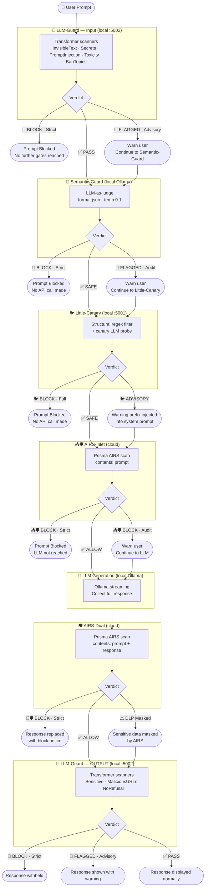
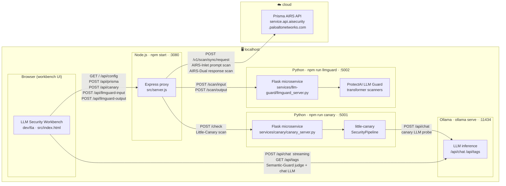

<!--
  WHAT THIS FILE HOLDS:
  Full system architecture for the LLM Security Workbench — component diagram,
  traffic routing table, six-gate security flow diagram, and Node proxy design notes.

  WHY IT EXISTS SEPARATELY:
  These diagrams and routing details are too detailed for README.md but are the
  authoritative reference for anyone building on top of, extending, or debugging
  the workbench infrastructure. README.md links here for readers who need depth.

  CROSS-REFERENCES:
  - docs/SECURITY-GATES.md  — per-gate logic and configuration details
  - docs/5-SETUP-GUIDE.md   — how to start each component
  - src/server.js           — the Node proxy implementation
-->

# Architecture

## Six-Gate Security Flow

When all six gates are active, every prompt passes through local transformer scanning, local LLM judgement, structural injection detection, and cloud scanning — before the LLM is called or the response is shown.

---

## Component Diagram

---

## Traffic Routing

| Traffic | Route |
| :--- | :--- |
| AIRS-Inlet / AIRS-Dual scans | Browser → Node Proxy `:3080/api/prisma` → Prisma AIRS API (cloud) |
| LLM-Guard input scan | Browser → Node Proxy `:3080/api/llmguard-input` → Flask sidecar `:5002/scan/input` |
| LLM-Guard output scan | Browser → Node Proxy `:3080/api/llmguard-output` → Flask sidecar `:5002/scan/output` |
| Little-Canary scan | Browser → Node Proxy `:3080/api/canary` → Flask sidecar `:5001/check` → Ollama |
| LLM inference | Browser → Local Ollama API `:11434` (direct, streaming) |
| Credential config | Browser → `GET /api/config` → `{ hasApiKey, profile }` (key never returned) |

---

## Node Proxy Design Notes

The Node.js proxy (`src/server.js`) exists for two reasons:

1. **CORS bypass** — Browsers block direct `fetch()` calls to Prisma AIRS and to the local Flask sidecars because they don't emit `Access-Control-Allow-Origin` headers. The Node proxy makes those requests server-side where CORS doesn't apply.

2. **Credential isolation** — `AIRS_API_KEY` is loaded from `.env` at startup and attached to outbound requests by the proxy. The browser never receives the key — only a boolean `hasApiKey` flag from `/api/config`.

**Key design point:** The browser talks **directly** to Ollama for all LLM inference (Semantic-Guard judge calls and chat streaming) but routes through the Node proxy for AIRS, LLM Guard, and Little-Canary. Direct Ollama access avoids double-buffering the streaming response; the proxy exists only to bypass CORS for cloud API calls and to keep the AIRS API key off the client.

Ollama requires `OLLAMA_ORIGINS=*` to accept requests from the browser. See the Quick Start in README.md.
