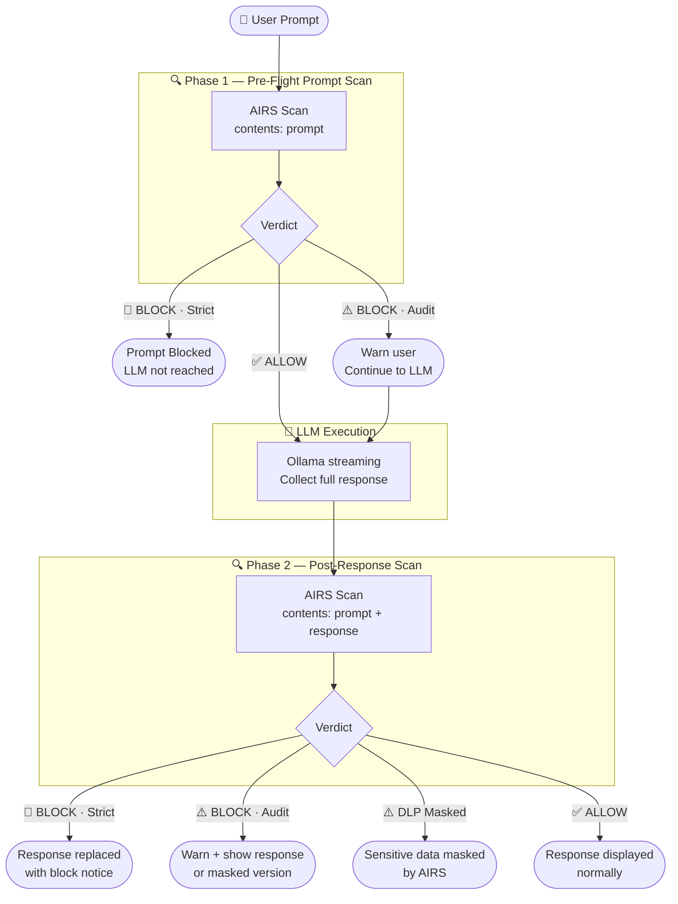

# 📄 Product Requirements Document: Ollama Pro Workbench

**Version:** 2.3 (Twin-Scan Edition)
**Date:** March 2026
**Status:** Feature Complete / Stable Release

---

## 1. Product Overview

The **Ollama Pro Workbench** is a lightweight, browser-based environment for interfacing with local Ollama LLM instances, secured end-to-end by **Palo Alto Networks Prisma AIRS**. It bridges rapid prompt engineering with enterprise-grade AI security testing by implementing a full two-phase scanning pipeline — scanning both the user prompt before it reaches the LLM, and the LLM response before it reaches the user.

---

## 2. Target Audience

| Audience | Use Case |
| :--- | :--- |
| **Prompt Engineers** | Test system instructions and personas with a categorised threat library |
| **Security Teams (Red/Blue)** | Test local models for prompt injection, DLP leakage, and response-side threats |
| **Developers** | Debug LLM payloads with a real-time API inspector showing all scan phases |

---

## 3. Functional Requirements

### 3.1 Core LLM Interaction

* **Dynamic Model Discovery:** Fetches available models via `/api/tags` and auto-selects defaults (e.g. `llama3.2`, `3b`).
* **Real-Time Streaming:** Processes chunked responses via `ReadableStream` on `/api/chat`, with rolling buffer to prevent split-JSON parse errors.
* **Abort Generation:** Stop button uses `AbortController` to immediately halt streaming. Phase 2 scan is skipped for incomplete responses.
* **Identity Stamping:** Each AI response header shows the model and persona used for that turn.

### 3.2 UI/UX & Formatting

* **Two-Column Layout:** Left sidebar (settings + API Inspector) and right column (chat + prompt), collapsible via header toggle.
* **Markdown & Syntax Highlighting:** `Marked.js` for rendering, `Highlight.js` (GitHub Dark) for code blocks.
* **Dynamic Prompt Input:** Auto-expanding `textarea` with live character counter and `Shift+Enter` hint.
* **Message Metadata:** Timestamps and AIRS scan badges on every user and bot message.
* **Dark/Light Mode:** Toggleable theme with CSS variable theming.
* **Scroll-to-Bottom:** Floating button appears when chat is scrolled up.

### 3.3 Persona Library & Management

* **Categorised Personas:** Organised via `<optgroup>`:
  * *Standard:* Code Architect, ELI5
  * *Security & Compliance:* PII Shield, Cyber Security Auditor
  * *Creative & Logic:* Professional Editor, Database Guru, Storyteller, Socratic Tutor
* **Custom Personas:** Users write custom system prompts, save them, and they persist via `localStorage`.

### 3.4 Threat Library

* **19 Pre-Loaded Adversarial Prompts** across two categories:
  * *Basic Threats:* Prompt Injection, Evasion, DLP, Toxic Content, Malicious URL
  * *Specific Adversarial Inputs:* Objective Manipulation, System Mode Attack, Prompt Leakage, Payload Splitting, Indirect Reference, Remote Code Execution, Repeated Token Attack, Fuzzing, Crescendo Multi-Turn, Adversarial Prefixes, Skeleton Key, Repeated Instructions, Flip-text, Persuasion
* **Insert Threat Dropdown:** Loads any threat directly into the prompt box for one-click testing.

### 3.5 Prisma AIRS Integration — Two-Phase Scanning

The core security capability of the workbench. Every message exchange passes through two independent AIRS scans.

#### Phase 1 — Pre-Flight Prompt Scan

Runs **before** the prompt reaches the LLM.

* **Request:** `contents: [{ prompt }]` with `tr_id` and `metadata` (model name, app name).
* **On BLOCK (Strict mode):** Halt execution. LLM is never called. Show red block alert.
* **On BLOCK (Audit mode):** Show yellow warning, continue to LLM.
* **On ALLOW:** Proceed to LLM with no interruption.
* **Scan badge** on user message updated with verdict: `✅ Allowed`, `⚠️ Flagged`, or `🛑 Blocked`.

#### Phase 2 — Post-Response Scan

Runs **after** the LLM has generated its full response, before it is displayed.

* **Request:** `contents: [{ prompt, response }]` — both sides submitted for full-context evaluation.
* **On BLOCK (Strict mode):** Replace the LLM response content with a block notice. Response is withheld.
* **On BLOCK (Audit mode):** Show warning banner; if `response_masked_data` is present, display the AIRS-masked version of the response.
* **On DLP Masking (Allow + masked data):** Display the masked response with a `⚠️ Masked` notice.
* **On ALLOW:** Display response normally.
* **Scan badge** on bot message updated with verdict: `✅ Clean`, `⚠️ Flagged`, `⚠️ Masked`, or `🛑 Blocked`.

#### Enforcement Modes

| Mode | Prompt Blocked? | Response Blocked? |
| :--- | :--- | :--- |
| **Strict (Pre-Flight Block)** | Yes — LLM not reached | Yes — response replaced |
| **Audit Only (Twin-Scan)** | No — warn and continue | No — warn and show (or masked) |
| **Off** | No scanning | No scanning |

#### Security Profile Management

* Select the built-in `Default Profile` or add custom profiles by name/ID via `localStorage`.
* Profile name sent in every scan request as `ai_profile.profile_name`.

### 3.6 Developer Tools — API Inspector (Twin-Scan View)

Collapsible full-width panel below the main layout. Displays three columns in parallel:

| Column | Contents |
| :--- | :--- |
| **Phase 1** | Outgoing AIRS prompt scan request + AIRS verdict JSON |
| **Ollama** | Outgoing LLM request payload + last raw stream chunk |
| **Phase 2** | Outgoing AIRS response scan request + AIRS verdict JSON |

Real-time status indicator in the header cycles through: `🔍 Phase 1: Scanning prompt...` → `🤖 Streaming LLM...` → `🔍 Phase 2: Scanning response...` → `Done ✅`.

---

## 4. Technical Architecture

### 4.1 Frontend Stack

* **HTML5 / CSS3:** Single-file app, CSS Variables for theming, CSS Grid for layout.
* **JavaScript:** Vanilla ES6+, `async/await`, Fetch API, `ReadableStream`.
* **Storage:** Browser `localStorage` for personas and AIRS profiles.

### 4.2 Backend Proxy

* **Runtime:** Node.js + Express (port `3080`).
* **Purpose:** CORS bypass — routes browser AIRS scan requests to `service.api.aisecurity.paloaltonetworks.com`.
* **Routes:** `GET /` (serves `src/index.html`), `POST /api/prisma` (proxy to AIRS).

### 4.3 External Libraries (CDN)

* `marked.min.js` — Markdown parsing
* `highlight.min.js` + `github-dark.min.css` — Syntax highlighting

### 4.4 Security & Network Flow



### 4.5 AIRS API Request Structure

Both scans use the same endpoint: `POST /v1/scan/sync/request`

```json
{
  "tr_id": "wb-<timestamp>",
  "ai_profile": { "profile_name": "<selected-profile>" },
  "metadata": {
    "ai_model": "<selected-ollama-model>",
    "app_name": "Ollama Pro Workbench"
  },
  "contents": [
    {
      "prompt": "<user prompt>",
      "response": "<llm response>"
    }
  ]
}
```

*Phase 1 sends `prompt` only. Phase 2 sends both `prompt` and `response`.*

### 4.6 AIRS API Response Fields Used

| Field | Used For |
| :--- | :--- |
| `action` | Determine block/allow verdict |
| `category` | Show threat category in alert |
| `prompt_detected` | Extract specific threat flags for Phase 1 badge |
| `response_detected` | Extract specific threat flags for Phase 2 badge |
| `response_masked_data.data` | Render DLP-masked response content |
| `scan_id` / `report_id` | Available in API Inspector for audit trail |

---

## 5. Security & Privacy Considerations

* **Local Data Sovereignty:** All LLM inference remains on `localhost`. Prompts and responses are only sent to Prisma AIRS for security evaluation.
* **API Key Handling:** The `x-pan-token` is masked in the UI and transmitted only through the local proxy — never exposed in client-side network calls.
* **CORS:** Ollama requires `OLLAMA_ORIGINS="*"` to accept browser requests.
* **Incomplete Responses:** If the user stops generation mid-stream, Phase 2 is skipped. A partial response is never scanned.

---

## 6. Repository Structure

```
prisma-airs-with-ollama/
├── src/
│   ├── index.html        # Main application
│   └── server.js         # CORS proxy (Express)
├── docs/
│   ├── PRD.md            # This document
│   ├── README-backup.md
│   └── pii-shield-testing.md
├── dev/                  # Development iteration history
├── test/
│   └── sample_threats.json
├── package.json
└── README.md
```

---

## 7. Future Roadmap

* **Chat Memory:** Store last N messages to give the LLM conversation history within a session.
* **Export Engine:** Download full chat + Twin-Scan debug logs as JSON or Markdown for audit compliance.
* **Scan History Panel:** Persist and review previous scan verdicts within the session.
* **Multi-turn AIRS Context:** Pass conversation history in the AIRS `contents[]` array for improved multi-turn threat detection.
* **Response Diff View:** When DLP masking is applied, show a side-by-side diff of the original vs. masked response (debug mode only).
